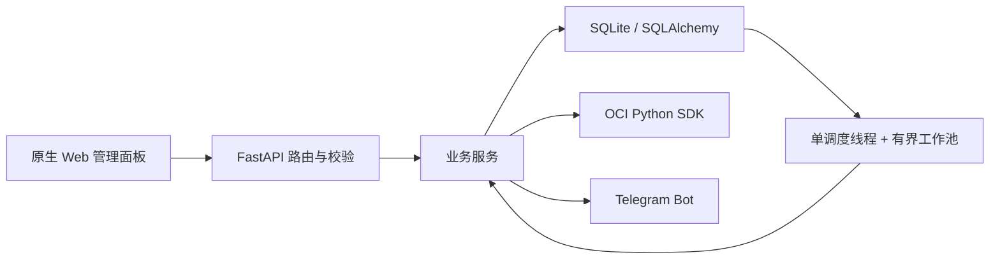

# OCI Helper

OCI Helper 是一个轻量的 Oracle Cloud 管理面板。后端使用 FastAPI、SQLAlchemy 和 OCI Python SDK；前端为不依赖 Node.js 运行时的原生 Web 应用。

## 核心功能

- 管理 OCI API 配置和托管私钥
- 在系统设置中修改管理员用户名和密码
- 创建、启动、停止、重启、改名和终止实例
- 使用 OpenSSH 公钥初始化 Linux 实例，不启用 root 密码登录
- 持久化创建任务与换 IP 任务，进程重启后自动恢复
- 在管理面板查看最新的任务执行日志
- 管理 VCN 默认安全列表、引导卷和服务限额
- 查询实例最近一小时的网络流量
- 使用 Telegram 发送任务创建、开机结果等通知和破坏性操作验证码

未实现的上游能力不会返回伪成功。本项目不包含数据库在线备份/恢复、Cloudflare、AI、Google 登录、MFA、定时播报和 VNC Web 代理；实例控制台接口只返回 OCI 生成的连接命令。

## 快速开始

### Docker Compose

```bash
cp .env.example .env
# 修改 .env 中的 OCI_HELPER_WEB_PASSWORD
docker compose pull
docker compose up -d
docker compose logs -f
```

Compose 默认使用 `ghcr.io/smallmx/ocihelper:latest`，可通过 `.env` 中的 `OCI_HELPER_IMAGE_TAG` 固定具体版本。宿主机端口默认只绑定 `127.0.0.1`；需要其他监听地址时必须显式设置 `OCI_HELPER_BIND_ADDRESS`，公网部署应使用 HTTPS 反向代理。发布镜像支持 `linux/amd64` 和 `linux/arm64`。Compose 使用命名卷保存数据库、OCI 私钥和文件日志，容器重建不会丢失数据。升级已有部署前请先备份对应 Docker 卷。

`OCI_HELPER_WEB_ACCOUNT` 和 `OCI_HELPER_WEB_PASSWORD` 是初始管理员凭据。通过 Web 管理页修改后，数据库中的凭据会优先于环境变量。

### 本地运行

需要 Python 3.11 或更高版本。

```bash
python3 -m venv .venv
source .venv/bin/activate
pip install -r requirements.txt
export OCI_HELPER_WEB_ACCOUNT=admin
export OCI_HELPER_WEB_PASSWORD='replace-with-at-least-12-characters'
python main.py
```

服务默认监听 `0.0.0.0:8888`。首次启动会创建数据库、迁移旧表，并在数据库旁生成权限为 `0600` 的 JWT 密钥文件 `.oci-helper-secret` 和凭据加密密钥文件 `.oci-helper-data-key`。

## OCI 配置

在管理面板中粘贴 OCI CLI 配置并上传对应 PEM 私钥。配置至少需要以下字段：

```ini
[DEFAULT]
user=<your-user-ocid>
tenancy=<your-tenancy-ocid>
region=<your-region>
fingerprint=<your-api-key-fingerprint>
```

私钥会复制到 `OCI_HELPER_KEY_DIR_PATH`，使用随机文件名和 `0600` 权限。删除配置时，应用只会删除该托管目录直属的私钥文件。

## 开机任务策略

创建任务支持区间重试策略：

- “最短创建间隔”和“最长创建间隔”控制每次 OCI 创建调用后的随机等待时间；两者相同即为固定间隔。旧客户端只提交 `interval` 时，最长间隔自动取相同值。
- 可用域留空时，任务会在支持目标 Shape 的可用域之间轮换；明确的容量不足会切换到下一个可用域，网络结果不确定时则在原可用域复用 OCI 幂等令牌，避免盲目重试产生重复实例。填写可用域时只在指定位置创建，并在提交到 OCI 前校验 Shape 是否可用。
- 每次调度只执行一次 `LaunchInstance`。创建多台实例时，成功创建一台后也会等待配置的随机间隔，避免单个任务长期占用工作线程或连续突发请求。
- 最大尝试次数按 OCI 创建调用总数统计，`0` 表示不限次数。任务的剩余数量、尝试次数和下一次执行时间会持久化；服务重启后会继续等待尚未到期的间隔。
- 创建任务必须提供一行或多行 OpenSSH 公钥。Ubuntu 使用 `ubuntu` 登录，Oracle Linux 和 CentOS 使用 `opc` 登录，需要 root 权限时执行 `sudo -i`。
- 引导卷性能默认使用高性能 `20 VPU/GB`，也可在创建任务时选择均衡 `10 VPU/GB` 或超高性能 `30–120 VPU/GB`。

任务列表会显示实际的间隔区间、尝试上限和可用域策略。任务提交成功后，Telegram 会收到不包含 SSH 公钥的任务摘要；“执行日志”页面可查看最新的调度、执行结果和错误日志。

## 管理员账号

“系统设置”中的管理员账号表单支持修改用户名，以及单独或同时修改密码。操作必须验证当前密码，新密码至少 12 个字符。密码以带随机盐的 PBKDF2-SHA256 哈希存入 SQLite，不会保存明文。

保存后凭据版本会轮换，所有已签发 JWT 立即失效，管理页会要求使用新凭据重新登录。数据库已有管理员凭据时，`OCI_HELPER_WEB_ACCOUNT` 和 `OCI_HELPER_WEB_PASSWORD` 不再覆盖它们，此时可以从 `.env` 中移除初始密码；使用全新数据库启动时仍须设置强密码。

## 关键配置

| 变量 | 默认值 | 说明 |
|---|---:|---|
| `OCI_HELPER_WEB_ACCOUNT` | `admin` | 初始管理账号；数据库已有管理员凭据时仅作为回退值 |
| `OCI_HELPER_WEB_PASSWORD` | 无 | 首次启动必填，至少 12 位且不能使用常见默认值；管理页保存凭据后可移除 |
| `OCI_HELPER_BIND_ADDRESS` | `127.0.0.1` | Docker Compose 的宿主机绑定地址；公网部署保持回环地址并使用 HTTPS 反代 |
| `OCI_HELPER_JWT_SECRET` | 自动生成 | 手工设置时至少 32 位 |
| `OCI_HELPER_DATA_ENCRYPTION_KEY` | 自动生成 | Telegram Token 的加密密钥，手工设置时至少 32 位 |
| `OCI_HELPER_DB_PATH` | `./data/oci-helper.db` | SQLite 数据库 |
| `OCI_HELPER_KEY_DIR_PATH` | `./keys` | 托管 OCI 私钥目录 |
| `OCI_HELPER_CORS_ORIGINS` | 空 | 逗号分隔的明确来源，不允许 `*` |
| `OCI_HELPER_TRUST_PROXY_HEADERS` | `false` | 仅在可信反向代理后开启 |
| `OCI_HELPER_TASK_WORKER_COUNT` | `8` | OCI 调用最大并发数 |
| `OCI_HELPER_CREATE_TASK_MAX_ATTEMPTS` | `1000` | API 未指定时的创建任务最大尝试次数，`0` 表示不限次数 |
| `OCI_HELPER_CHANGE_IP_INTERVAL_SECONDS` | `10` | 目标 CIDR 换 IP 间隔 |
| `OCI_HELPER_CHANGE_IP_MAX_ATTEMPTS` | `120` | 目标 CIDR 最大尝试次数 |
| `OCI_HELPER_OCI_REQUEST_TIMEOUT_SECONDS` | `120` | 单次 OCI HTTP 请求超时 |

完整示例见 [.env.example](.env.example)。

> 已配置 Telegram 时不要更换 `OCI_HELPER_DATA_ENCRYPTION_KEY`、删除 `.oci-helper-data-key` 或丢失数据卷；否则已保存的 Bot Token 无法解密。JWT 密钥可独立轮换，轮换后现有登录令牌会失效。

## 架构概览



所有 OCI SDK 调用都在线程池中执行，避免阻塞 FastAPI 事件循环。调度器只让正在调用 OCI 的任务占用工作线程；等待下次重试的任务由单个调度线程管理。任务状态和尝试次数存入 SQLite，可在进程重启后恢复。

后台任务不会在线程池中直接调用 Telegram。开机和换 IP 结果会与任务状态一同写入 SQLite 通知发件箱，再由 FastAPI 主事件循环统一发送；临时失败会有限重试，未发送事件可在进程重启后恢复。

Flex Shape 使用任务提交的 OCPU 和内存；固定规格 `VM.Standard.E2.1.Micro` 自动使用其固定的 1 OCPU / 1 GB 配置，避免任务记录与实际实例不一致。

## 安全边界

- JWT 只接受 `Authorization: Bearer` 请求头，不接受 URL 查询参数。
- 管理员密码只持久化强哈希；修改管理员凭据后立即废止已有 JWT。
- 登录失败按客户端 IP 限流；只有显式启用时才信任代理 IP 请求头。
- Linux 实例只写入 SSH 公钥，不收集 root 密码，也不通过 `cloud-init` 开启 root 密码登录。
- Telegram Bot Token 使用独立密钥进行 Fernet 加密；日志和 API 不返回明文凭据。
- 终止实例、终止引导卷和删除 VCN 必须使用 5 分钟有效的 Telegram 验证码。
- VCN 级联删除只允许本工具创建且未混入外部资源的 `oci-helper-vcn`；其他非空 VCN 会被拒绝。
- API、前端响应设置了缓存限制和基础浏览器安全响应头。

应用不能替代 OCI IAM 最小权限策略。建议为本工具创建专用 OCI 用户，只授予实际使用功能需要的权限，并在外层反向代理启用 TLS。

## 数据迁移

启动时会按顺序执行幂等 SQLite 迁移：

- 补充持久化任务状态、错误和重试字段
- 补充 SSH 公钥字段
- 清理重复活动任务并创建部分唯一索引
- 加密旧配置中的明文 Telegram Bot Token
- 创建持久化通知发件箱

旧版数据库应放到 `OCI_HELPER_DB_PATH` 指向的位置。迁移不会删除旧的 `ip_data` 等退役表，避免自动丢失用户数据；新代码不会再读写这些表。

## 开发指南

前端源码位于 `frontend/`。修改后生成 FastAPI 使用的静态文件：

```bash
python frontend/build.py
```

执行离线冒烟测试：

```bash
python -m unittest discover -s tests -v
```

前端回归测试使用 Node.js 内置测试运行器，无需安装 npm 依赖，覆盖页面请求竞态、弹窗生命周期、分页和通知表单状态：

```bash
node --test frontend/tests/app.test.cjs
```

可选静态检查：

```bash
pip install -r requirements-dev.txt
ruff check .
```

测试覆盖应用生命周期、数据库初始化、登录鉴权、管理员凭据修改、统一参数错误、前端入口、请求别名和缓存淘汰。真实 OCI 操作需要有效租户凭据，不属于离线测试范围。

## 许可证

本项目基于上游 OCI Helper 精简和重构，延续 [Apache License 2.0](LICENSE)。
